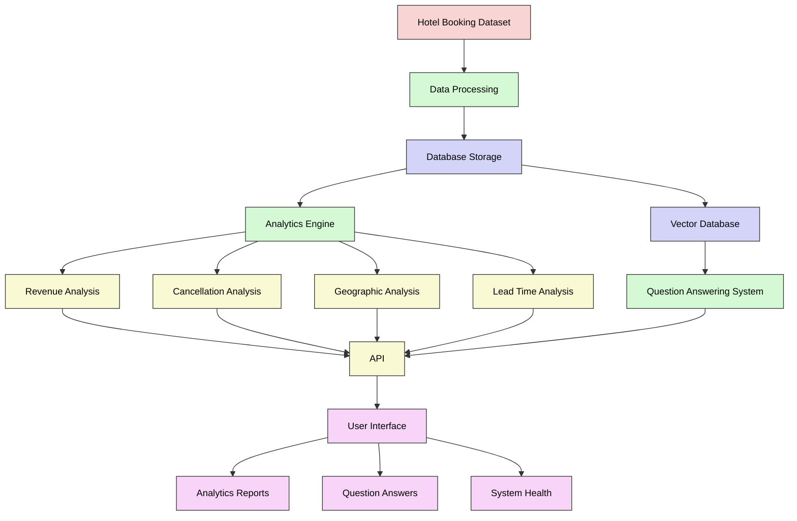

# 🏨 Hotel Booking Analytics & QA System 🚀


An intelligent system that processes hotel booking data, generates insightful analytics, and answers natural language questions using AI. Perfect for hotel managers, data analysts, and businesses in the hospitality industry.

## ✨ Features

- 📊 **Advanced Analytics**
 - Revenue trends over time
 - Cancellation rate analysis
 - Geographical distribution of bookings
 - Booking lead time patterns

- 🤖 **AI-Powered Q&A**
 - Natural language question answering
 - Retrieval-Augmented Generation (RAG)
 - Context-aware responses

- 🔌 **API Integration**
 - RESTful endpoints
 - Interactive documentation
 - JSON response format

- 🔄 **Real-time Updates** 
 - Live data processing
 - Query history tracking
 - System health monitoring

## 🛠️ Tech Stack

- **Backend**: FastAPI, Python
- **Database**: PostgreSQL
- **Vector Search**: FAISS
- **AI/ML**: Sentence Transformers, TinyLlama
- **Data Processing**: Pandas, NumPy, SQLAlchemy
- **Visualization**: Matplotlib, Seaborn

## 📋 Prerequisites

- Python 3.9+
- PostgreSQL 14+
- Git

## 🚀 Quick Start

### 1. Clone and Setup

```bash
# Clone the repository
git clone https://github.com/yourusername/hotel_booking_backend.git
cd hotel-booking-analytics

# Create virtual environment
python -m venv venv
venv\Scripts\activate  # On Windows
source venv/bin/activate  # On macOS/Linux

# Install dependencies
pip install -r requirements.txt
```

## 📁 Project Structure

```
hotel-booking-analytics/
│
├── .env.example               # Example environment variables
│
├── requirements.txt           # Project dependencies
│
├── scripts/
│   ├── init_db.py             # Database initialization
│   ├── load_data.py           # Data loading
│   └── build_embeddings.py    # Vector embeddings creation
│
├── src/
│   ├── __init__.py
│   ├── config.py              # Configuration settings
│   │
│   ├── analytics/
│   │   ├── __init__.py
│   │   ├── revenue.py         # Revenue analytics
│   │   ├── cancellation.py    # Cancellation analytics
│   │   ├── geographic.py      # Geographic distribution
│   │   ├── lead_time.py       # Booking lead time
│   │   └── visualizer.py      # Visualization utilities
│   │
│   ├── data/
│   │   ├── __init__.py
│   │   ├── db_manager.py      # Database operations
│   │   ├── loader.py          # Data loading utilities
│   │   └── cleaner.py         # Data cleaning utilities
│   │
│   ├── rag/
│   │   ├── __init__.py
│   │   ├── embedder.py        # Text embedding utilities
│   │   ├── vector_store.py    # FAISS interface
│   │   ├── llm.py             # LLM integration
│   │   └── query_engine.py    # Question answering logic
│   │
│   └── api/
│       ├── __init__.py
│       ├── main.py            # FastAPI application
│       ├── routers/
│       │   ├── __init__.py
│       │   ├── analytics.py   # Analytics endpoints
│       │   ├── ask.py         # Q&A endpoints
│       │   └── health.py      # Health check endpoint
│       └── models/
│           ├── __init__.py
│           └── schemas.py     # API request/response models
│
└── README.md                  # Project documentation
```


> **Note:** The `data` folder has been removed from the repository due to large space occupancy. You will need to create this directory structure and download the dataset yourself.

# Project Flowchart


